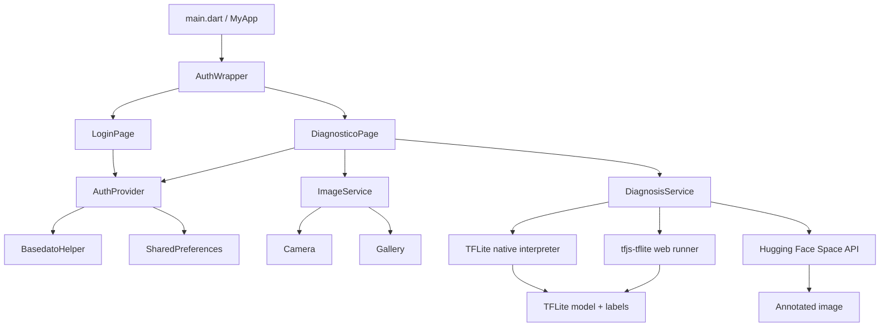

# CacaoScan

[](https://flutter.dev)
[](https://dart.dev)
[](https://www.tensorflow.org/lite)
[](https://pub.dev/packages/provider)
[](#license)

CacaoScan is a Flutter application for assisted visual diagnosis of cacao fruit diseases, focused on moniliasis detection. It combines a local TensorFlow Lite SSD model for offline inference with an optional online Hugging Face Space flow that returns an annotated prediction image.

The project exists to make cacao image analysis available from a simple mobile-first interface: users sign in, capture or select an image, tune detection sensitivity, and run diagnosis using either the bundled model or the remote model endpoint.

## Features

| Area | Implemented behavior |
| --- | --- |
| Authentication | Local login flow with form validation, password visibility toggle, error feedback, session persistence, and logout. |
| Seed user | A default administrator account is inserted into the local SQLite database on supported native platforms. |
| Session restore | `shared_preferences` stores authentication state and user metadata between launches. |
| Image input | Users can take a photo with the camera or choose an image from the gallery through `image_picker`. |
| Image optimization | Picked images are constrained to `1280x1280` with JPEG quality `85` before analysis. |
| Offline diagnosis | Loads `assets/modelo_cacao_monilia_ssd.tflite` and runs local SSD inference. |
| Web offline diagnosis | Uses `tfjs-tflite` through `web/tflite_web_runner.js` when running on Flutter Web. |
| Online diagnosis | Uploads the selected image to a Hugging Face Space and downloads the annotated result image. |
| Sensitivity controls | Confidence threshold is adjustable for both modes; IoU is adjustable for the online flow only. |
| Results | Shows detection status, confidence, raw model summary, offline detection list, and online annotated image bytes when available. |
| Responsive UI | Login and diagnosis screens are centered with max-width constraints for phone, tablet, desktop, and web layouts. |

## Architecture

CacaoScan follows a compact layered Flutter structure:



### Application Layers

| Layer | Files | Responsibility |
| --- | --- | --- |
| App bootstrap | `lib/main.dart` | Initializes Flutter, registers `AuthProvider`, configures Material 3 theming, and starts `AuthWrapper`. |
| Routing gate | `lib/providers/auth_wrapper.dart` | Restores persisted auth state and selects either login or diagnosis UI. |
| State management | `lib/providers/auth_provider.dart` | Owns authentication state, user metadata, login/logout actions, and session persistence. |
| Data access | `lib/Data/basedato_helper*.dart` | Provides local credential lookup using SQLite on native platforms and a stub fallback elsewhere. |
| Services | `lib/services/*.dart` | Encapsulates image picking, local inference, web inference, remote inference, and result models. |
| Views | `lib/View/**/*.dart` | Contains the login and diagnosis screens. |
| Assets | `assets/` | Stores brand images, labels, and the bundled TensorFlow Lite model. |
| Platform shells | `android/`, `ios/`, `web/`, `linux/`, `macos/`, `windows/` | Flutter platform runners and native build configuration. |

## Technology Stack

| Technology | Usage |
| --- | --- |
| Flutter | Cross-platform UI framework. |
| Dart | Application language; SDK constraint is `^3.9.2`. |
| Provider | `ChangeNotifier`-based auth state management. |
| TensorFlow Lite | Native offline model execution through a vendored `tflite_flutter` package. |
| TensorFlow.js TFLite | Browser-side TFLite execution for Flutter Web via CDN scripts and `web/tflite_web_runner.js`. |
| SQLite / sqflite | Native local user table and credential lookup. |
| shared_preferences | Persisted login state and basic user metadata. |
| image_picker | Camera and gallery access. |
| image | Native image decoding/resizing before TFLite inference. |
| http | Hugging Face Space upload, prediction polling, and annotated image download. |
| crypto | SHA-256 hashing for stored local password hashes. |

Firebase is not used by the application code or declared dependencies. The current GitHub Actions workflow checks for `ios/Runner/GoogleService-Info.plist`, but no Firebase package is configured in `pubspec.yaml`.

## Project Structure

```text
.
|-- assets/
|   |-- brand/
|   |   |-- cacao_app_icon_1024.png
|   |   |-- cacao_logo.png
|   |   `-- cacao_mark.png
|   |-- labels_cacao_monilia_ssd.txt
|   `-- modelo_cacao_monilia_ssd.tflite
|-- lib/
|   |-- Data/
|   |   |-- basedato_helper.dart
|   |   |-- basedato_helper_io.dart
|   |   `-- basedato_helper_stub.dart
|   |-- View/
|   |   |-- auth/login_page.dart
|   |   `-- diagnostico_page.dart
|   |-- providers/
|   |   |-- auth_provider.dart
|   |   `-- auth_wrapper.dart
|   |-- services/
|   |   |-- diagnosis_service.dart
|   |   |-- diagnosis_service_io.dart
|   |   |-- diagnosis_service_stub.dart
|   |   `-- image_service.dart
|   `-- main.dart
|-- web/
|   |-- index.html
|   |-- manifest.json
|   `-- tflite_web_runner.js
|-- android/
|-- ios/
|-- linux/
|-- macos/
|-- windows/
|-- third_party/tflite_flutter/
|-- pubspec.yaml
|-- pubspec.lock
`-- analysis_options.yaml
```

## Screens

| Screen | File | Responsibility |
| --- | --- | --- |
| Login | `lib/View/auth/login_page.dart` | Displays the CacaoScan logo, collects email/password, validates inputs, invokes `AuthProvider.login`, and renders authentication errors. |
| Auth loading gate | `lib/providers/auth_wrapper.dart` | Shows a loading indicator while persisted session data is restored. |
| Diagnosis | `lib/View/diagnostico_page.dart` | Displays the authenticated user greeting, model mode switch, threshold controls, image preview, image source actions, analyze action, errors, and diagnosis results. |

Navigation is intentionally minimal: the app does not define named routes. `AuthWrapper` switches the root view according to `AuthProvider.isAuthenticated`.

## Installation

### Requirements

| Tool | Required by project |
| --- | --- |
| Flutter | `>=3.35.0` according to `pubspec.lock`; this repository was inspected with Flutter `3.38.9`. |
| Dart | `>=3.9.2 <4.0.0`. |
| Android Studio / SDK | Required for Android builds. |
| Xcode + CocoaPods | Required for iOS builds; `ios/Podfile` targets iOS `13.0`. |
| Network access | Required for `flutter pub get`, web TFLite CDN scripts, and online Hugging Face diagnosis. |

### Setup

```bash
git clone <repository-url>
cd Moniliasis-Cacao
flutter pub get
```

The TensorFlow Lite Flutter plugin is resolved from the local path `third_party/tflite_flutter`, so keep that directory with the repository.

## Running

### Android

```bash
flutter run -d android
```

Android permissions are declared for camera, internet, legacy external storage, and modern image media access.

### iOS

```bash
cd ios
pod install
cd ..
flutter run -d ios
```

The iOS configuration includes camera and photo library usage descriptions. The app display name is `CacaoScan`.

### Web

```bash
flutter run -d chrome
```

Flutter Web uses `web/index.html` to load TensorFlow.js Core, the CPU backend, `@tensorflow/tfjs-tflite`, and the project-specific `tflite_web_runner.js`. Offline web inference requires those CDN scripts to load successfully.

### Desktop

Flutter platform folders exist for Linux, macOS, and Windows. The primary application code is cross-platform, but SQLite and TFLite behavior depends on plugin support for each target.

## Development Login

The current code seeds or exposes one default account:

| Field | Value |
| --- | --- |
| Email | `admin@gmail.com` |
| Password | `admin123` |
| Name | `Administrador` |

On native platforms, the password is stored as a SHA-256 hash in SQLite. On non-IO builds, the stub helper validates the same credentials directly.

Change this before shipping any production build.

## TensorFlow Lite

### Assets

| Asset | Purpose |
| --- | --- |
| `assets/modelo_cacao_monilia_ssd.tflite` | Bundled offline SSD object detection model. |
| `assets/labels_cacao_monilia_ssd.txt` | Label map used by the offline model. |

Current labels:

```text
0 healthy
1 monilia
2 phytophthora
```

### Native Offline Pipeline

`DiagnosisService` uses conditional exports:

- `lib/services/diagnosis_service.dart` selects `diagnosis_service_io.dart` when `dart.library.io` is available.
- `diagnosis_service_io.dart` loads the model with `Interpreter.fromAsset`.
- Labels are read with `rootBundle.loadString`.
- The selected image bytes are decoded with the `image` package.
- The image is resized to `320x320`.
- Pixels are normalized to RGB float values in the range `0.0..1.0`.
- Inference runs with `runForMultipleInputs`.
- The service expects SSD-style outputs: scores, boxes, number of detections, and classes.
- Detections below the selected confidence threshold are discarded.
- Results are sorted by confidence.
- `moniliasisDetected` is true when any accepted label contains `monilia`.

The offline UI exposes confidence threshold control. IoU is shown but disabled in offline mode because post-processing/NMS is handled inside the TFLite model output path used by the app.

### Web Offline Pipeline

The web fallback loads model bytes from Flutter assets, then delegates execution to `globalThis.CacaoScanTflite` in `web/tflite_web_runner.js`.

That runner:

- loads `@tensorflow/tfjs-tflite`;
- creates a single-thread TFLite model instance;
- decodes image bytes in the browser;
- draws the image into a `320x320` canvas;
- builds a float RGB tensor;
- reads model output tensors;
- identifies SSD boxes, classes, scores, and detection count;
- applies the confidence threshold and returns sorted detection objects to Dart.

### Online Pipeline

When the user enables online mode, `DiagnosisService` calls the Hugging Face Space at:

```text
https://bdarquea-cocoa-diseases-localization.hf.space
```

The flow is:

1. Upload the selected image to `/upload` as multipart field `files`.
2. Start prediction through `/call/predict`.
3. Send the uploaded file descriptor plus confidence and IoU thresholds.
4. Poll `/call/predict/{event_id}` for the Gradio event result.
5. Resolve the returned file path or URL.
6. Download the annotated image bytes.
7. Display the annotated image in the result card.

The online result does not parse structured detection boxes from the Space response; it displays the annotated image returned by the remote model.

## Database

SQLite is used on IO platforms through `sqflite`.

| Property | Value |
| --- | --- |
| Database name | `mydatabase.db` |
| Version | `8` |
| Table | `usuarios` |

Schema:

```sql
CREATE TABLE IF NOT EXISTS usuarios (
  id INTEGER PRIMARY KEY AUTOINCREMENT,
  nombre TEXT NOT NULL,
  correo TEXT UNIQUE NOT NULL,
  passwordHash TEXT NOT NULL
);
```

Database behavior:

- `BasedatoHelper` is a singleton.
- The database is opened lazily and cached for reuse.
- The users table is created on create, upgrade, and open.
- The default administrator is inserted with `ConflictAlgorithm.ignore`.
- Login queries by `correo` and compares the SHA-256 hash of the submitted password.
- The returned user object contains only `id`, `nombre`, and `correo`.

Session persistence is separate from SQLite. `AuthProvider` stores `isAuthenticated`, `userEmail`, `userId`, and `userName` in `shared_preferences`.

## Build Configuration

| Platform | Current configuration |
| --- | --- |
| Android | Kotlin Gradle plugin `2.1.0`, Android Gradle plugin `8.9.1`, Gradle `8.12`, Java `11`, package namespace `com.example.cacaoscan`. |
| iOS | CocoaPods with `use_frameworks!`, minimum platform `13.0`. |
| Web | Manifest configured as standalone PWA named `CacaoScan`; TFLite web dependencies loaded from jsDelivr. |
| Analysis | Uses `package:flutter_lints/flutter.yaml` and excludes `third_party/**`. |
| CI | Manual GitHub Actions workflow builds an unsigned iOS IPA and uploads it as an artifact. |

The Android release build currently signs with the debug signing config, matching the default Flutter template behavior in this repository.

## Code Quality

The application has a clear separation between UI, state, data access, image acquisition, and diagnosis services:

- UI widgets do not directly query SQLite or call remote endpoints.
- Authentication state is centralized in `AuthProvider`.
- Platform-specific database and diagnosis behavior is isolated through conditional exports.
- Model result data is represented with `DiagnosisResult` and `DetectionBox`.
- The diagnosis screen owns transient UI state such as selected image, active mode, thresholds, loading states, errors, and latest result.
- Linting is configured with Flutter's recommended lint set.

Areas that are intentionally simple today:

- There is no custom router.
- There are no domain model files beyond the result classes embedded in the diagnosis service.
- There are no automated tests in the repository.
- There is no production account provisioning flow.

## Performance

Observed performance considerations in the implementation:

- The native TFLite interpreter and labels are loaded once and reused until `DiagnosisService.dispose`.
- Selected images are downscaled by `image_picker` before inference, reducing memory pressure.
- Offline native preprocessing resizes images to `320x320`, matching the model input size used by the service.
- Offline native preprocessing builds nested Dart lists, which is simple but may allocate heavily for repeated analyses.
- The web runner caches the model promise to avoid loading the TFLite model repeatedly.
- Online diagnosis uses a 90-second timeout for upload, prediction, polling, and annotated image download.
- Online mode depends on remote service availability and network latency.

## Security

Current security properties:

- Native local passwords are stored as SHA-256 hashes instead of plaintext.
- Login error messages do not reveal whether the email or password was incorrect.
- Authenticated session metadata is stored locally with `shared_preferences`.
- Online mode uploads the selected image to a third-party Hugging Face Space.
- Android requests camera, internet, and image storage/media permissions.
- iOS declares camera and photo library usage descriptions.

Important limitations:

- The default development account is hard-coded and should not be used in production.
- Plain SHA-256 without a per-user salt or adaptive password hashing is not sufficient for production authentication.
- `shared_preferences` is not secure storage.
- The project does not currently include encryption, biometric auth, server-side auth, or role management.
- The remote Space endpoint is hard-coded in the diagnosis service.

## Testing and Validation

Recommended local checks:

```bash
flutter pub get
flutter analyze
flutter test
```

At the time of this README rewrite, no `test/` directory exists. `flutter test` is still useful as a guard because it verifies that the Flutter test harness can compile the project.

## Future Improvements

Realistic next steps based on the current architecture:

- Replace the default account with a proper user provisioning flow.
- Move secrets, endpoints, and build-time environment choices into configuration.
- Add widget tests for login validation, auth routing, and diagnosis screen states.
- Add unit tests for `AuthProvider`, database login behavior, label parsing, and Hugging Face response parsing.
- Introduce secure storage for session data if the app handles sensitive accounts.
- Optimize offline preprocessing with typed buffers to reduce allocations.
- Add structured parsing for online detections if the remote model can return boxes and labels as JSON.
- Add model metadata documentation: training dataset, evaluation metrics, input/output tensor contract, and versioning.
- Replace Android debug signing in release builds with a production signing configuration.
- Align or remove the CI `GoogleService-Info.plist` check unless Firebase is intentionally added.
- Add a repository license and contribution policy files.

## Contributing

Contributions should keep the implementation consistent with the current layering:

1. Keep UI concerns in `lib/View`.
2. Keep shared state in providers.
3. Keep image acquisition and inference behavior in services.
4. Keep platform-specific code behind conditional exports where possible.
5. Do not document features that are not implemented.
6. Run `flutter analyze` before opening a pull request.
7. Add focused tests when changing authentication, persistence, inference parsing, or platform-specific behavior.

Suggested pull request checklist:

- [ ] The change is scoped and described clearly.
- [ ] User-facing behavior is documented when it changes.
- [ ] New assets are declared in `pubspec.yaml` if needed.
- [ ] Platform permissions are updated when new device capabilities are used.
- [ ] `flutter analyze` passes.
- [ ] Relevant tests are added or updated.

## License

No license file is currently present in this repository. Add a license before publishing the project as open source. MIT, Apache-2.0, and BSD-3-Clause are common choices for Flutter applications; choose the one that matches the intended distribution and contribution model.

## Author

Maintained by **Fran Vasquez**.

For academic, field, or production use, include model provenance, validation data, and deployment constraints alongside this repository so users can understand the diagnostic limitations of the application.
