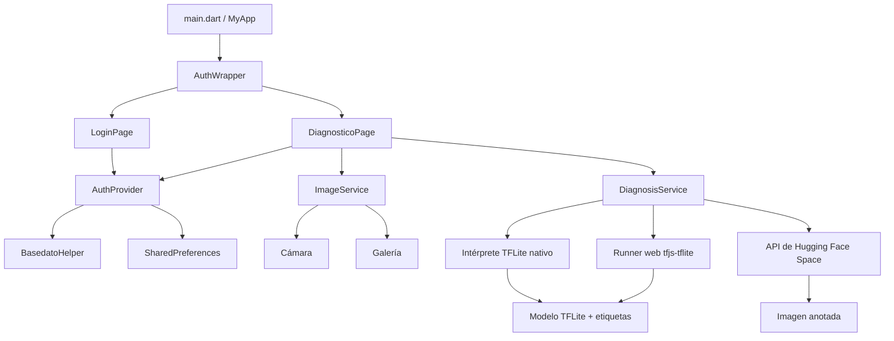

# CacaoScan

[](https://flutter.dev)
[](https://dart.dev)
[](https://www.tensorflow.org/lite)
[](https://pub.dev/packages/provider)
[](#licencia)

CacaoScan es una aplicación Flutter para diagnóstico visual asistido de enfermedades en frutos de cacao, con foco en la detección de moniliasis. Combina un modelo SSD local en TensorFlow Lite para inferencia offline con un flujo online opcional basado en un Space de Hugging Face que devuelve una imagen anotada con predicciones.

El proyecto existe para acercar el análisis de imágenes de cacao a una interfaz móvil simple: el usuario inicia sesión, toma o selecciona una imagen, ajusta la sensibilidad del modelo y ejecuta el diagnóstico con el modelo incluido en la app o con el endpoint remoto.

## Funcionalidades

| Área | Comportamiento implementado |
| --- | --- |
| Autenticación | Flujo de login local con validación de formulario, visibilidad de contraseña, mensajes de error, persistencia de sesión y cierre de sesión. |
| Usuario inicial | Se inserta una cuenta administradora por defecto en SQLite en plataformas nativas compatibles. |
| Restauración de sesión | `shared_preferences` guarda estado de autenticación y metadatos básicos del usuario entre ejecuciones. |
| Entrada de imágenes | El usuario puede tomar una foto con la cámara o seleccionar una imagen desde la galería mediante `image_picker`. |
| Optimización de imágenes | Las imágenes seleccionadas se limitan a `1280x1280` con calidad JPEG `85` antes del análisis. |
| Diagnóstico offline | Carga `assets/modelo_cacao_monilia_ssd.tflite` y ejecuta inferencia SSD local. |
| Diagnóstico offline en web | Usa `tfjs-tflite` mediante `web/tflite_web_runner.js` cuando la app corre en Flutter Web. |
| Diagnóstico online | Sube la imagen seleccionada a un Space de Hugging Face y descarga la imagen anotada resultante. |
| Controles de sensibilidad | El umbral de confianza se puede ajustar en ambos modos; IoU solo se puede ajustar en el flujo online. |
| Resultados | Muestra estado de detección, confianza, resumen bruto del modelo, lista de detecciones offline e imagen anotada online cuando está disponible. |
| UI adaptable | Las pantallas de login y diagnóstico usan restricciones de ancho para funcionar en teléfono, tablet, escritorio y web. |

## Arquitectura

CacaoScan sigue una estructura Flutter compacta por capas:



### Capas de la aplicación

| Capa | Archivos | Responsabilidad |
| --- | --- | --- |
| Arranque de app | `lib/main.dart` | Inicializa Flutter, registra `AuthProvider`, configura el tema Material 3 e inicia `AuthWrapper`. |
| Puerta de navegación | `lib/providers/auth_wrapper.dart` | Restaura el estado de sesión persistido y decide entre la UI de login o diagnóstico. |
| Manejo de estado | `lib/providers/auth_provider.dart` | Administra estado de autenticación, datos del usuario, login/logout y persistencia de sesión. |
| Acceso a datos | `lib/Data/basedato_helper*.dart` | Provee validación local de credenciales con SQLite en plataformas nativas y un fallback stub en otros entornos. |
| Servicios | `lib/services/*.dart` | Encapsula selección de imágenes, inferencia local, inferencia web, inferencia remota y modelos de resultado. |
| Vistas | `lib/View/**/*.dart` | Contiene las pantallas de login y diagnóstico. |
| Assets | `assets/` | Almacena imágenes de marca, etiquetas y el modelo TensorFlow Lite incluido. |
| Runners de plataforma | `android/`, `ios/`, `web/`, `linux/`, `macos/`, `windows/` | Configuración nativa y runners generados por Flutter. |

## Stack tecnológico

| Tecnología | Uso |
| --- | --- |
| Flutter | Framework multiplataforma para la interfaz. |
| Dart | Lenguaje de la aplicación; la restricción del SDK es `^3.9.2`. |
| Provider | Manejo de estado de autenticación basado en `ChangeNotifier`. |
| TensorFlow Lite | Ejecución nativa del modelo offline mediante el paquete vendorizado `tflite_flutter`. |
| TensorFlow.js TFLite | Ejecución TFLite en navegador para Flutter Web mediante scripts CDN y `web/tflite_web_runner.js`. |
| SQLite / sqflite | Tabla local de usuarios y validación de credenciales en plataformas nativas. |
| shared_preferences | Persistencia de sesión y metadatos básicos de usuario. |
| image_picker | Acceso a cámara y galería. |
| image | Decodificación y redimensionamiento nativo antes de la inferencia TFLite. |
| http | Subida a Hugging Face Space, polling de predicción y descarga de imagen anotada. |
| crypto | Hash SHA-256 para contraseñas locales almacenadas. |

Firebase no está usado en el código de la aplicación ni declarado en las dependencias. El workflow actual de GitHub Actions verifica `ios/Runner/GoogleService-Info.plist`, pero no hay ningún paquete Firebase configurado en `pubspec.yaml`.

## Estructura del proyecto

```text
.
|-- assets/
|   |-- brand/
|   |   |-- cacao_app_icon_1024.png
|   |   |-- cacao_logo.png
|   |   `-- cacao_mark.png
|   |-- labels_cacao_monilia_ssd.txt
|   `-- modelo_cacao_monilia_ssd.tflite
|-- lib/
|   |-- Data/
|   |   |-- basedato_helper.dart
|   |   |-- basedato_helper_io.dart
|   |   `-- basedato_helper_stub.dart
|   |-- View/
|   |   |-- auth/login_page.dart
|   |   `-- diagnostico_page.dart
|   |-- providers/
|   |   |-- auth_provider.dart
|   |   `-- auth_wrapper.dart
|   |-- services/
|   |   |-- diagnosis_service.dart
|   |   |-- diagnosis_service_io.dart
|   |   |-- diagnosis_service_stub.dart
|   |   `-- image_service.dart
|   `-- main.dart
|-- web/
|   |-- index.html
|   |-- manifest.json
|   `-- tflite_web_runner.js
|-- android/
|-- ios/
|-- linux/
|-- macos/
|-- windows/
|-- third_party/tflite_flutter/
|-- pubspec.yaml
|-- pubspec.lock
`-- analysis_options.yaml
```

## Pantallas

| Pantalla | Archivo | Responsabilidad |
| --- | --- | --- |
| Login | `lib/View/auth/login_page.dart` | Muestra el logo de CacaoScan, solicita correo y contraseña, valida campos, ejecuta `AuthProvider.login` y renderiza errores de autenticación. |
| Verificación de sesión | `lib/providers/auth_wrapper.dart` | Muestra un indicador de carga mientras se restaura la sesión persistida. |
| Diagnóstico | `lib/View/diagnostico_page.dart` | Muestra saludo del usuario, selector de modo, controles de umbral, vista previa de imagen, acciones de imagen, botón de análisis, errores y resultados. |

La navegación es intencionalmente mínima: la app no define rutas con nombre. `AuthWrapper` cambia la vista raíz según `AuthProvider.isAuthenticated`.

## Instalación

### Requisitos

| Herramienta | Requerimiento del proyecto |
| --- | --- |
| Flutter | `>=3.35.0` según `pubspec.lock`; este repositorio fue inspeccionado con Flutter `3.38.9`. |
| Dart | `>=3.9.2 <4.0.0`. |
| Android Studio / SDK | Necesario para builds Android. |
| Xcode + CocoaPods | Necesario para builds iOS; `ios/Podfile` usa iOS mínimo `13.0`. |
| Acceso a red | Necesario para `flutter pub get`, scripts CDN de TFLite web y diagnóstico online con Hugging Face. |

### Configuración

```bash
git clone <repository-url>
cd Moniliasis-Cacao
flutter pub get
```

El plugin Flutter de TensorFlow Lite se resuelve desde la ruta local `third_party/tflite_flutter`, por lo que ese directorio debe mantenerse dentro del repositorio.

## Ejecución

### Android

```bash
flutter run -d android
```

Android declara permisos para cámara, internet, almacenamiento externo legacy y acceso moderno a imágenes.

### iOS

```bash
cd ios
pod install
cd ..
flutter run -d ios
```

La configuración iOS incluye descripciones de uso para cámara y biblioteca de fotos. El nombre visible de la app es `CacaoScan`.

### Web

```bash
flutter run -d chrome
```

Flutter Web usa `web/index.html` para cargar TensorFlow.js Core, el backend CPU, `@tensorflow/tfjs-tflite` y el runner propio `tflite_web_runner.js`. La inferencia offline en web requiere que esos scripts CDN carguen correctamente.

### Escritorio

El repositorio incluye carpetas de plataforma para Linux, macOS y Windows. El código principal de la aplicación es multiplataforma, pero el comportamiento de SQLite y TFLite depende del soporte de plugins para cada destino.

## Login de desarrollo

El código actual inserta o expone una cuenta por defecto:

| Campo | Valor |
| --- | --- |
| Correo | `admin@gmail.com` |
| Contraseña | `admin123` |
| Nombre | `Administrador` |

En plataformas nativas, la contraseña se almacena como hash SHA-256 en SQLite. En builds no IO, el helper stub valida directamente las mismas credenciales.

Cambia estas credenciales antes de publicar cualquier build de producción.

## TensorFlow Lite

### Assets

| Asset | Propósito |
| --- | --- |
| `assets/modelo_cacao_monilia_ssd.tflite` | Modelo SSD offline incluido en la aplicación. |
| `assets/labels_cacao_monilia_ssd.txt` | Mapa de etiquetas usado por el modelo offline. |

Etiquetas actuales:

```text
0 healthy
1 monilia
2 phytophthora
```

### Pipeline offline nativo

`DiagnosisService` usa exports condicionales:

- `lib/services/diagnosis_service.dart` selecciona `diagnosis_service_io.dart` cuando `dart.library.io` está disponible.
- `diagnosis_service_io.dart` carga el modelo con `Interpreter.fromAsset`.
- Las etiquetas se leen con `rootBundle.loadString`.
- Los bytes de la imagen seleccionada se decodifican con el paquete `image`.
- La imagen se redimensiona a `320x320`.
- Los pixeles se normalizan como valores RGB flotantes en el rango `0.0..1.0`.
- La inferencia se ejecuta con `runForMultipleInputs`.
- El servicio espera salidas tipo SSD: puntajes, cajas, número de detecciones y clases.
- Las detecciones por debajo del umbral de confianza seleccionado se descartan.
- Los resultados se ordenan por confianza.
- `moniliasisDetected` es verdadero cuando alguna etiqueta aceptada contiene `monilia`.

La UI offline expone control del umbral de confianza. IoU se muestra pero está deshabilitado en modo offline porque el postprocesamiento/NMS queda dentro del flujo de salida TFLite usado por la app.

### Pipeline offline web

El fallback web carga los bytes del modelo desde los assets de Flutter y delega la ejecución a `globalThis.CacaoScanTflite` en `web/tflite_web_runner.js`.

Ese runner:

- carga `@tensorflow/tfjs-tflite`;
- crea una instancia TFLite de un solo hilo;
- decodifica los bytes de la imagen en el navegador;
- dibuja la imagen en un canvas de `320x320`;
- construye un tensor RGB flotante;
- lee los tensores de salida del modelo;
- identifica cajas SSD, clases, puntajes y cantidad de detecciones;
- aplica el umbral de confianza y devuelve a Dart detecciones ordenadas.

### Pipeline online

Cuando el usuario activa el modo online, `DiagnosisService` llama al Space de Hugging Face en:

```text
https://bdarquea-cocoa-diseases-localization.hf.space
```

El flujo es:

1. Subir la imagen seleccionada a `/upload` como campo multipart `files`.
2. Iniciar la predicción mediante `/call/predict`.
3. Enviar el descriptor del archivo subido junto con los umbrales de confianza e IoU.
4. Consultar `/call/predict/{event_id}` para obtener el resultado del evento Gradio.
5. Resolver la ruta o URL devuelta.
6. Descargar los bytes de la imagen anotada.
7. Mostrar la imagen anotada en la tarjeta de resultado.

El resultado online no parsea cajas de detección estructuradas desde la respuesta del Space; muestra la imagen anotada devuelta por el modelo remoto.

## Base de datos

SQLite se usa en plataformas IO mediante `sqflite`.

| Propiedad | Valor |
| --- | --- |
| Nombre de base de datos | `mydatabase.db` |
| Versión | `8` |
| Tabla | `usuarios` |

Esquema:

```sql
CREATE TABLE IF NOT EXISTS usuarios (
  id INTEGER PRIMARY KEY AUTOINCREMENT,
  nombre TEXT NOT NULL,
  correo TEXT UNIQUE NOT NULL,
  passwordHash TEXT NOT NULL
);
```

Comportamiento de base de datos:

- `BasedatoHelper` es un singleton.
- La base se abre de forma diferida y se cachea para reutilización.
- La tabla de usuarios se crea en create, upgrade y open.
- El administrador por defecto se inserta con `ConflictAlgorithm.ignore`.
- El login consulta por `correo` y compara el hash SHA-256 de la contraseña enviada.
- El objeto de usuario retornado contiene solo `id`, `nombre` y `correo`.

La persistencia de sesión está separada de SQLite. `AuthProvider` guarda `isAuthenticated`, `userEmail`, `userId` y `userName` en `shared_preferences`.

## Configuración de build

| Plataforma | Configuración actual |
| --- | --- |
| Android | Kotlin Gradle plugin `2.1.0`, Android Gradle plugin `8.9.1`, Gradle `8.12`, Java `11`, namespace `com.example.cacaoscan`. |
| iOS | CocoaPods con `use_frameworks!`, plataforma mínima `13.0`. |
| Web | Manifest configurado como PWA standalone llamada `CacaoScan`; dependencias TFLite web cargadas desde jsDelivr. |
| Análisis | Usa `package:flutter_lints/flutter.yaml` y excluye `third_party/**`. |
| CI | Workflow manual de GitHub Actions que compila un IPA iOS sin firma y lo sube como artefacto. |

El build release de Android actualmente firma con la configuración debug, siguiendo el comportamiento del template Flutter presente en este repositorio.

## Calidad de código

La aplicación separa con claridad UI, estado, acceso a datos, adquisición de imágenes y servicios de diagnóstico:

- Los widgets de UI no consultan SQLite ni llaman endpoints remotos directamente.
- El estado de autenticación está centralizado en `AuthProvider`.
- El comportamiento específico de plataforma para base de datos y diagnóstico se aísla mediante exports condicionales.
- Los datos de resultado del modelo se representan con `DiagnosisResult` y `DetectionBox`.
- La pantalla de diagnóstico administra estado transitorio de UI como imagen seleccionada, modo activo, umbrales, estados de carga, errores y último resultado.
- El linting está configurado con el set recomendado de Flutter.

Áreas que hoy son intencionalmente simples:

- No hay router personalizado.
- No hay modelos de dominio separados más allá de las clases de resultado embebidas en el servicio de diagnóstico.
- No hay tests automatizados en el repositorio.
- No hay flujo de aprovisionamiento de cuentas de producción.

## Rendimiento

Consideraciones de rendimiento observadas en la implementación:

- El intérprete TFLite nativo y las etiquetas se cargan una sola vez y se reutilizan hasta `DiagnosisService.dispose`.
- Las imágenes seleccionadas se reducen con `image_picker` antes de la inferencia, disminuyendo presión de memoria.
- El preprocesamiento offline nativo redimensiona imágenes a `320x320`, alineado con el tamaño de entrada usado por el servicio.
- El preprocesamiento offline nativo construye listas Dart anidadas; es simple, pero puede generar muchas asignaciones en análisis repetidos.
- El runner web cachea la promesa del modelo para evitar cargar TFLite repetidamente.
- El diagnóstico online usa timeout de 90 segundos para subida, predicción, polling y descarga de imagen anotada.
- El modo online depende de disponibilidad del servicio remoto y latencia de red.

## Seguridad

Propiedades actuales de seguridad:

- En nativo, las contraseñas locales se almacenan como hashes SHA-256 en lugar de texto plano.
- Los errores de login no revelan si falló el correo o la contraseña.
- Los metadatos de sesión autenticada se almacenan localmente con `shared_preferences`.
- El modo online sube la imagen seleccionada a un Space de Hugging Face de terceros.
- Android solicita permisos de cámara, internet y acceso a almacenamiento/media de imágenes.
- iOS declara descripciones de uso para cámara y biblioteca de fotos.

Limitaciones importantes:

- La cuenta de desarrollo por defecto está hardcodeada y no debe usarse en producción.
- SHA-256 simple, sin salt por usuario ni hashing adaptativo, no es suficiente para autenticación de producción.
- `shared_preferences` no es almacenamiento seguro.
- El proyecto no incluye cifrado, autenticación biométrica, autenticación de servidor ni manejo de roles.
- El endpoint remoto del Space está hardcodeado en el servicio de diagnóstico.

## Pruebas y validación

Comandos locales recomendados:

```bash
flutter pub get
flutter analyze
flutter test
```

Al momento de esta reescritura del README, no existe directorio `test/`. `flutter test` sigue siendo útil como guardia cuando se agreguen pruebas, pero actualmente fallará por ausencia de ese directorio.

## Mejoras futuras

Próximos pasos realistas según la arquitectura actual:

- Reemplazar la cuenta por defecto con un flujo real de aprovisionamiento de usuarios.
- Mover secretos, endpoints y decisiones de entorno/build a configuración.
- Agregar widget tests para validación de login, ruteo de autenticación y estados de la pantalla de diagnóstico.
- Agregar unit tests para `AuthProvider`, login contra base local, parseo de etiquetas y parseo de respuestas de Hugging Face.
- Introducir almacenamiento seguro para datos de sesión si la app maneja cuentas sensibles.
- Optimizar el preprocesamiento offline con buffers tipados para reducir asignaciones.
- Agregar parseo estructurado de detecciones online si el modelo remoto puede devolver cajas y etiquetas como JSON.
- Documentar metadatos del modelo: dataset de entrenamiento, métricas de evaluación, contrato de tensores de entrada/salida y versionado.
- Reemplazar la firma debug de Android en builds release con una configuración de firma de producción.
- Alinear o eliminar el check de CI para `GoogleService-Info.plist` si Firebase no se agrega intencionalmente.
- Agregar una licencia y archivos de política de contribución al repositorio.

## Contribución

Las contribuciones deben mantener la implementación consistente con las capas actuales:

1. Mantener la UI en `lib/View`.
2. Mantener estado compartido en providers.
3. Mantener adquisición de imágenes e inferencia en servicios.
4. Mantener código específico de plataforma detrás de exports condicionales cuando sea posible.
5. No documentar funcionalidades que no estén implementadas.
6. Ejecutar `flutter analyze` antes de abrir un pull request.
7. Agregar pruebas enfocadas al cambiar autenticación, persistencia, parseo de inferencia o comportamiento específico de plataforma.

Checklist sugerido para pull requests:

- [ ] El cambio está acotado y descrito claramente.
- [ ] El comportamiento visible para el usuario está documentado cuando cambia.
- [ ] Los assets nuevos están declarados en `pubspec.yaml` si corresponde.
- [ ] Los permisos de plataforma se actualizan cuando se usan nuevas capacidades del dispositivo.
- [ ] `flutter analyze` pasa.
- [ ] Las pruebas relevantes se agregan o actualizan.

## Licencia

Actualmente no existe un archivo de licencia en este repositorio. Agrega una licencia antes de publicar el proyecto como open source. MIT, Apache-2.0 y BSD-3-Clause son opciones comunes para aplicaciones Flutter; elige la que corresponda al modelo de distribución y contribución previsto.

## Autor

Mantenido por **Fran Vasquez**.

Para uso académico, de campo o producción, acompaña este repositorio con procedencia del modelo, datos de validación y restricciones de despliegue para que los usuarios entiendan las limitaciones diagnósticas de la aplicación.
